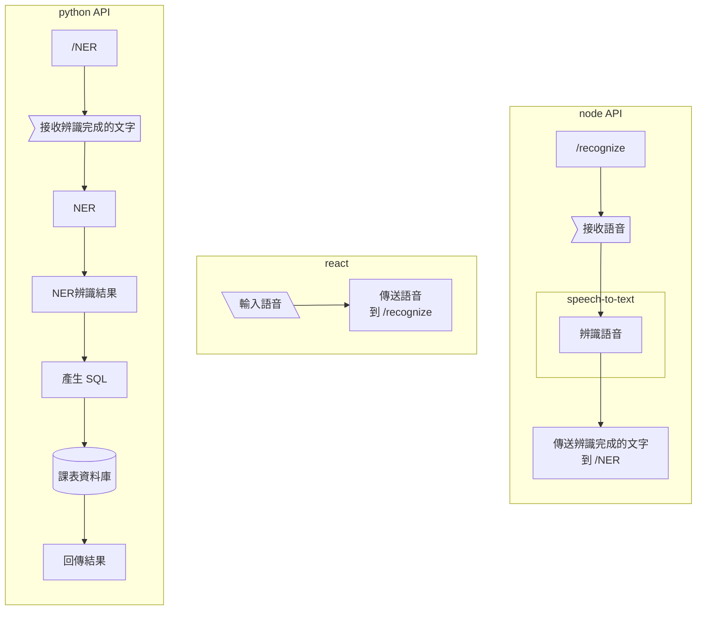

### Todo List

UI:
- [x] 搜尋結果 table
- [x] 提示

backend:
- [ ] 搜尋結果函式化
- [ ] 連結 python
- [ ] cors credentials

bug:
- [ ] 空字串
- [ ] 暖機

- 字對
- 字不對，音對
- 字不對，音不對
- 字不對，音不對，鄰近的音也不對

```mermaid
flowchart
ner_result[NER辨識結果]
input_audio[\輸入語音\]
recognize_audio[辨識語音]
send_record[傳送語音<br>到 /recognize]
receive_record>接收語音]
send_recognized_text["傳送辨識完成的文字<br>到 /NER"]
receive_recognized_text>接收辨識完成的文字]
NER[NER]
postRecognize["/recognize"]
generate_sql["產生 SQL"]


db[(課表資料庫)]

subgraph "node API"
    direction TB
    receive_record --> recognize_audio
    subgraph speech-to-text
        recognize_audio
    end
        recognize_audio --> send_recognized_text
    send_recognized_text

    postRecognize --> receive_record
end

subgraph react
    direction LR
    input_audio --> send_record
end


subgraph "python API"
    direction TB
    apiNER["/NER"] --> receive_recognized_text
    receive_recognized_text --> NER
    NER --> ner_result
    ner_result --> generate_sql --> db
    db --> 回傳結果
end


```